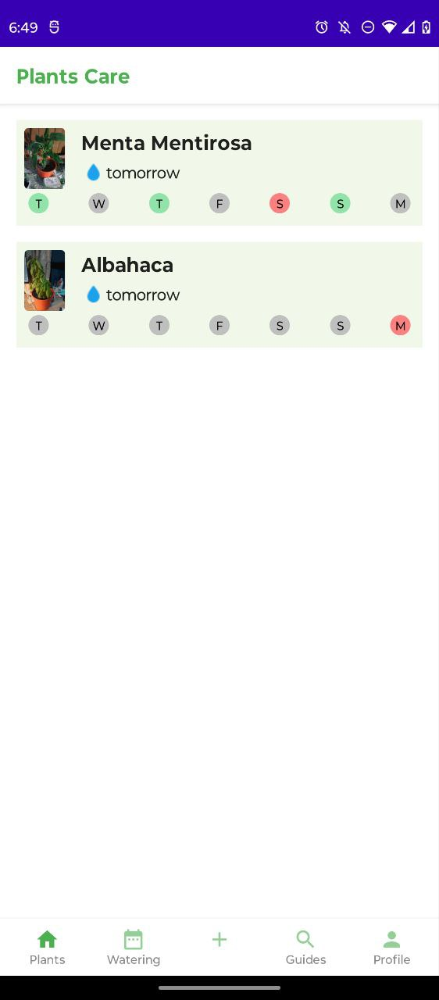
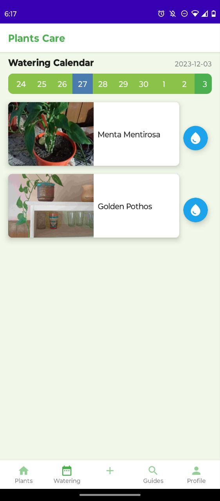
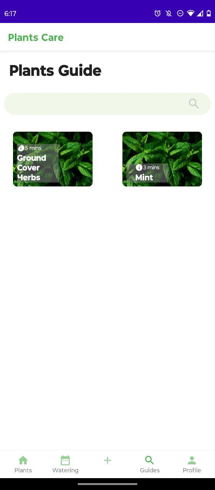
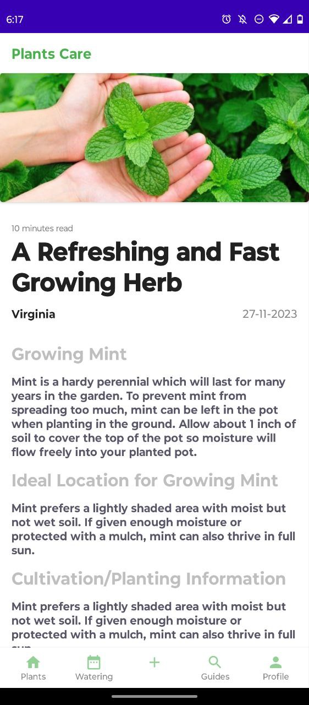
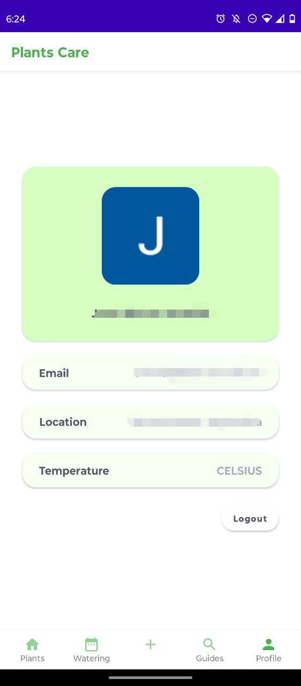
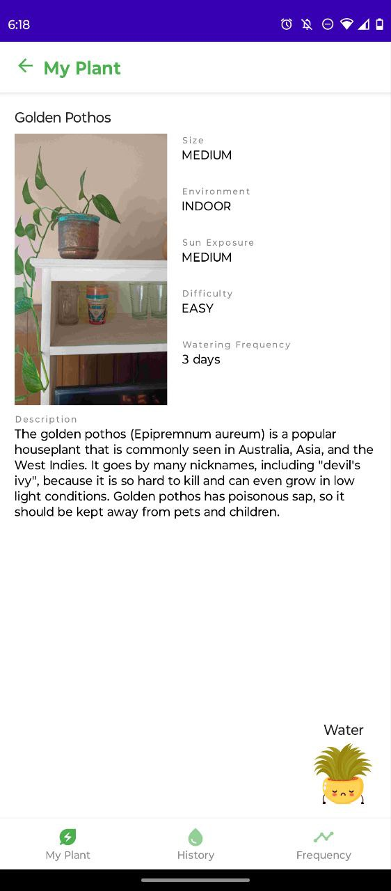
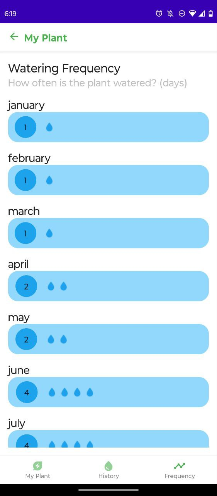
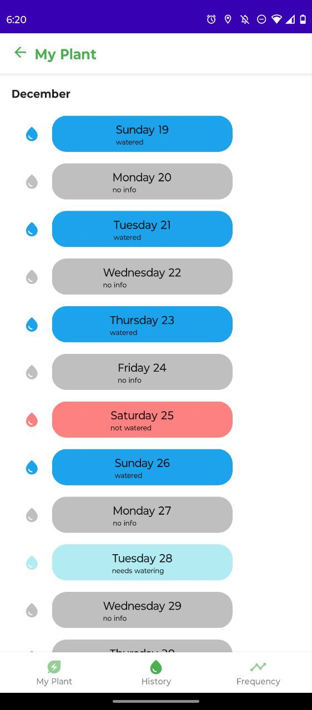
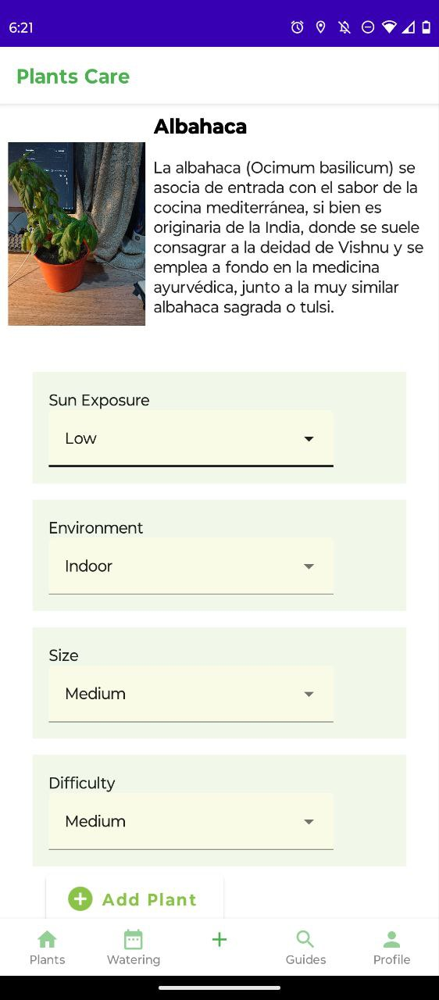
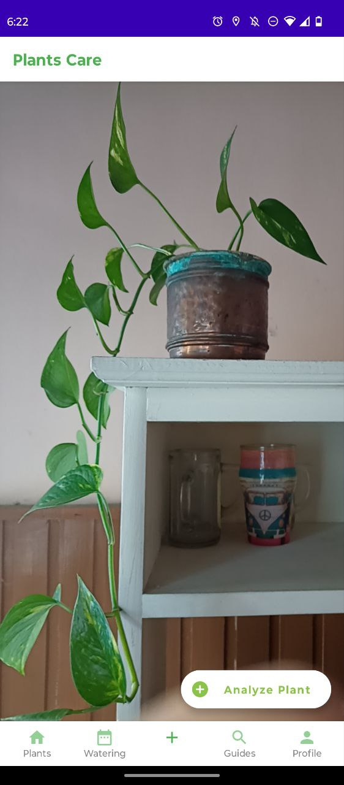

# PlantsCare 🌱

Your Essential Gardening Companion

## About this app

🌿 Never miss a watering day with PlantCare! This app tailors a personalized watering calendar for your plants and offers expert tips for their optimal care.

✨ **Key Features:**

- **Plant Profile 🌱** - Manage individual plant details in a profile.

- **Watering Schedule 🚿** - Set customized watering frequencies.

- **Reminder Notifications ⏰** - Receive timely watering reminders.

- **Calendar View 🗓️** - Visualize plant care activities on a calendar.

- **Care Guides 📚** - Access comprehensive plant care guides.

- **Plant Database 📊** - Explore and add plants to your collection.

- **Photo Gallery 📸** - Document plant growth with pictures.

## Screenshots

## License

MIT License - Please have a look at the [LICENSE](LICENSE) for more details.
